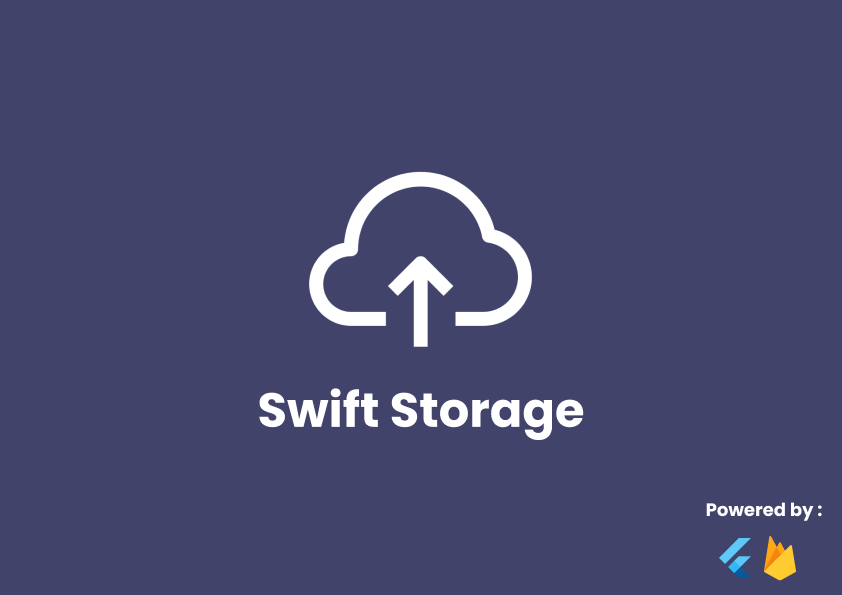

# Swift Storage

## Description
In day-to-day life there is a constant need for small, temporary storage solutions like at xerox centres, transferring documents from your mobile to computer or when you are not carrying your pendrive. Logging onto your Google Drive needs 2 step authentication which is a lengthy process. Swift Storage provides you with a temporary storage for wasy and quick document transfer.

## Hosted on 
[https://swift-storage.web.app/]("https://swift-storage.web.app/") using Firebase Hosting.

## Features
1. Swift storage is a web app available on all platforms with internet access.
2. Upto 20MB of storage per room.
3. All room data and storage data gets cleared at 24:00 IST using **Cloud Schedular and Cloud Functions**.

## Learnings
1. [Cloud functions]("https://firebase.google.com/docs/functions") by Firebase.
    - Use cloud functions to manipulate data from firestore database and firebase storage.
    - Subscribe to [**Topics**]("https://cloud.google.com/pubsub/docs/admin") and trigger CRUD operations on firebase. 
2. [Cloud Schedular]("https://cloud.google.com/scheduler/") by GCP.
    - Learnt on how to scheduling tasks using Pub/Sub and HTTP.
    - Unix-cron format.

## Clone repository
Install [Git]("https://git-scm.com/") on your device.
On the terminal.
>`git clone https://github.com/vedantbarve/swift_storage.git`

## References
- [https://cloud.google.com/pubsub/docs/admin#create_a_topic]("https://cloud.google.com/pubsub/docs/admin#create_a_topic")
- [https://firebase.google.com/docs/functions]("https://firebase.google.com/docs/functions")
- [https://medium.com/google-cloud/building-a-slack-reminder-app-with-google-cloud-functions-and-google-cloud-scheduler-4046f4c9c19]("https://medium.com/google-cloud/building-a-slack-reminder-app-with-google-cloud-functions-and-google-cloud-scheduler-4046f4c9c19")

## Credits
[Soaham Pimparkar]("https://github.com/soaham-pimparkar")
